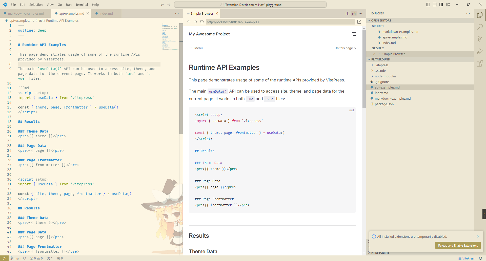

# VitePress Preview

A very small extension which use vscode builtin simple browser to preview VitePress pages.

## Screenshot

## Command

There are two commands:

- VitePress: Start Preview Server
- VitePress: Stop Preview Server

## Configuration

- `vp.autStart`: Start VitePress server when open workspace, default is false.
- `vp.docsDir`: VitePress docs folder, relative path to current workspace. Example: "docs". (You need to restart VitePress preview server if you change this option.)
- `vp.port`: VitePress server port, default is 4001.

## Bugs

If you find any bugs, please [open an issue][open-issue].

Enjoy!

[open-issue]: https://github.com/0x-jerry/vscode-vitepress/issues/new?assignees=&labels=&projects=&template=bug_report.md&title=
